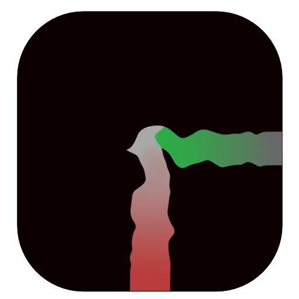
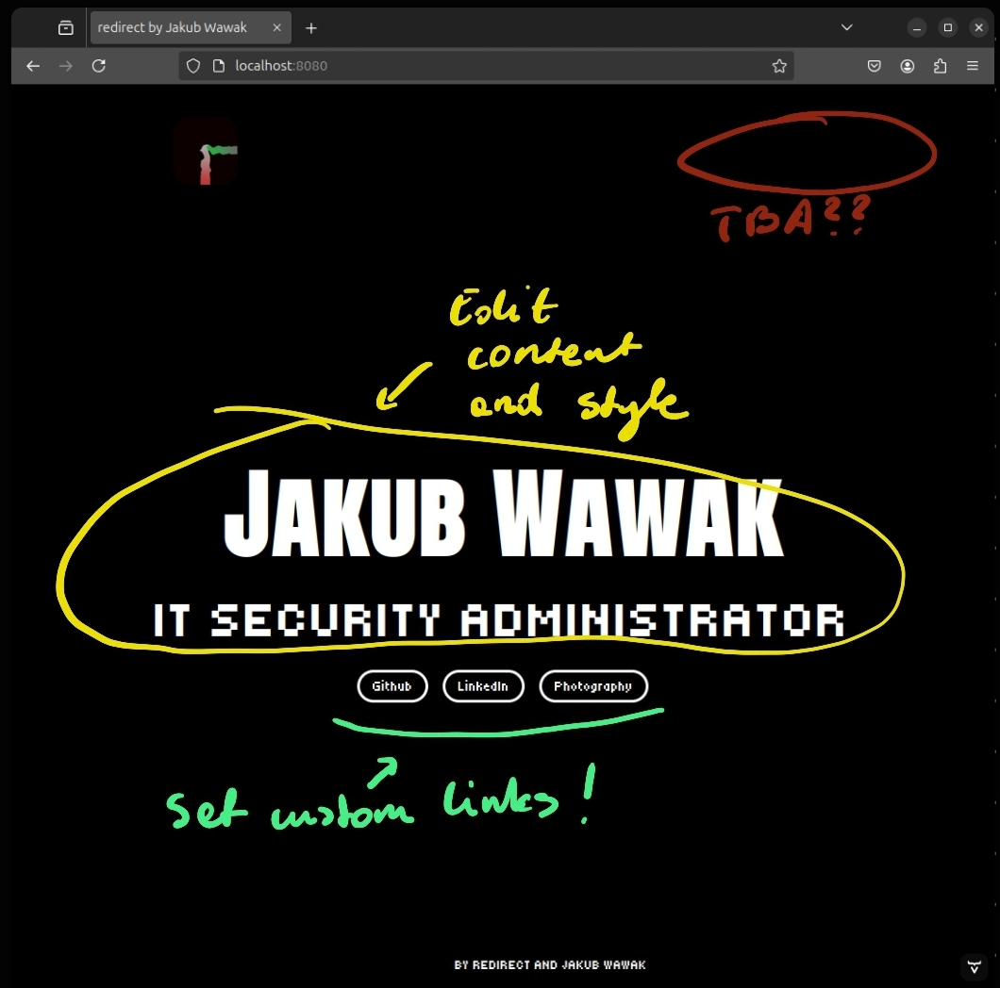

# redirect

Web application for creating personal redirection pages. Using Java/Spring-Boot/MySQL and Vaadin as a frontend framework.

**Apache 2.0 License - feel free to fork / use!**

### Current application state:

POC, currently in development

<u>Features:</u>

- [X] Simple front page with edition functionality.
- [X] Card creation with custom header, email, phone and quote. Custom QR with link is also available.
- [ ] Projects page with projects manager in the terminal.
- [ ] Blog functionality with blog entry importer as Markdown file in terminal.
- [ ] CV Page functionality with web editor.

### How to use

The basic possibility of changing the application's appearance and content settings is the .properties file.
This file is created when the application is first launched. Through the fields in this file you can edit the content
of the home page and basic settings. 

To change the page style (font, background color, etc.) use the CSS file located in the /frontend/themes/redirectheme folder.

### How to deploy

1. Download latest Release or build from source using maven `maven clean package -P production`
2. Copy the target folder to the server ( if you build from source ) or unzip the release package in the desired location.
3. Run the application using command `java -jar redirect.jar`.
4. Fill the .properties file with the necessary data.
5. Rerun the application, you can specify custom port with flag `--server.port=8080` for example. Appliaction will create the SQLite database.

### Terminal Commands

- `exit` Exits the application. **Usage**: `exit` 
- `debug`Toggles the debug mode on or off. **Usage**: `debug` 
- `cardinfomanager` Allows entering card information (header, email, phone, quote) for database insertion. **Usage**: `cardinfomanager`